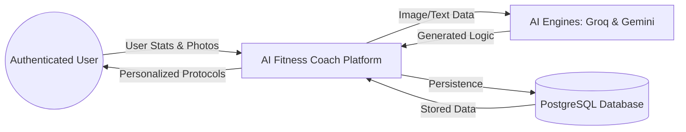
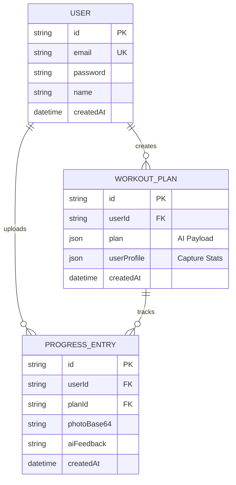
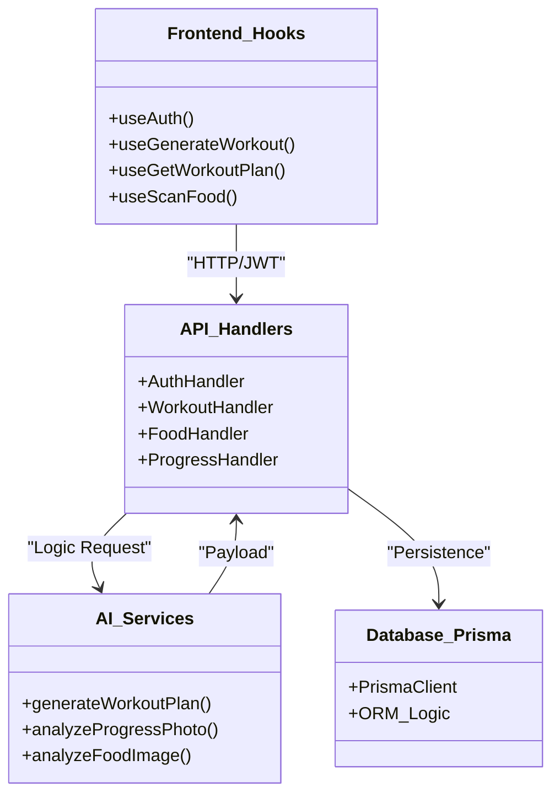
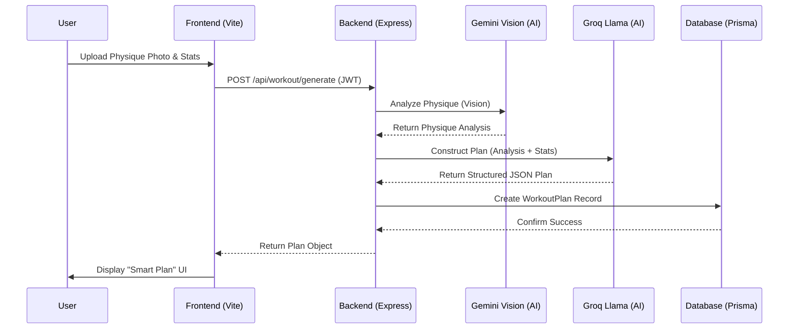

# SYSTEM DESIGN & ARCHITECTURE SUITE

This document contains the complete technical blueprint of the AI Fitness Coach platform. It includes logical data flows, database relationships, and structural code mapping.

---

## 1. DATA FLOW DIAGRAMS (DFD)

### DFD Level-0 (Context Diagram)
Shows the high-level boundary of the system and its external interactions.



### DFD Level-1 (Logical Process Flow)
Breaks down internal transformations of data.

```mermaid
graph TD
    User((User))
    P1[Auth Handler]
    P2[Protocol Engine]
    P3[Vision Scanner]
    P4[Progress Tracker]
    DB[(PostgreSQL)]
    AI_Text[Groq Llama]
    AI_Vision[Gemini Vision]

    User -- "Login/Signup" --> P1
    P1 -- "JWT Token" --> User
    P1 -- "User Data" --> DB

    User -- "Physique Data" --> P2
    P2 -- "Prompt" --> AI_Text
    AI_Text -- "Workout JSON" --> P2
    P2 -- "Plan Record" --> DB

    User -- "Food Image" --> P3
    P3 -- "Vision Analysis" --> AI_Vision
    AI_Vision -- "Nutrition Data" --> P3

    User -- "Progress Photo" --> P4
    P4 -- "Physique Scan" --> AI_Vision
    AI_Vision -- "AI Review" --> P4
    P4 -- "Progress Entry" --> DB
```



---

## 2. DATABASE DESIGN (ER DIAGRAM)

The system uses a PostgreSQL schema managed by Prisma.



---

## 3. CLASS & COMPONENT DIAGRAM

Models the relationship between Frontend Hooks and Backend Services.



---

## 4. USE CASE DIAGRAM

Defines user goals and system boundaries.

```mermaid
useCaseDiagram
    actor User as "Authenticated User"
    actor AI as "AI System"

    package "AI Fitness Coach" {
        usecase UC1 as "Register/Login"
        usecase UC2 as "Input Biological Stats"
        usecase UC3 as "Generate Personalized Protocol"
        usecase UC4 as "Scan Food Items"
        usecase UC5 as "Analyze Physique Progress"
        usecase UC6 as "Review AI Feedback"
    }

    User --> UC1
    User --> UC2
    User --> UC3
    User --> UC4
    User --> UC5
    User --> UC6

    UC3 -- "Requires" --> AI
    UC4 -- "Requires" --> AI
    UC5 -- "Requires" --> AI
```

---

## 5. UML SEQUENCE DIAGRAM (PLAN GENERATION)

Visualizes the lifecycle of a single "Protocol Engineering" request.



---

## 6. CODE CONNECTIVITY MAP

| Frontend Page | Logic / Component | API Endpoint | Backend Logic | DB Interaction |
| :--- | :--- | :--- | :--- | :--- |
| **Login** | `useAuth()` | `POST /api/auth/login` | `auth.ts` -> `signToken()` | `prisma.user.findUnique` |
| **Generate Plan** | `GeneratePlan.tsx` | `POST /api/workout/generate` | `workout.ts` -> `grok.ts` | `prisma.workoutPlan.create` |
| **Dashboard** | `Dashboard.tsx` | `GET /api/workout/plans` | `workout.ts` | `prisma.workoutPlan.findMany` |
| **Scan AI** | `ScanAI.tsx` | `POST /api/food/scan` | `food.ts` -> `grok.ts` | N/A (Transient analysis) |
| **Detail View** | `PlanDetail.tsx` | `GET /api/workout/plans/:id` | `workout.ts` | `prisma.workoutPlan.findFirst` |
| **Track Progress**| `ProgressTracker.tsx` | `POST /api/progress` | `progress.ts` -> `grok.ts` | `prisma.progressEntry.create` |

---

## 7. SYSTEM DESIGN SUMMARY

The platform is designed as a **Decoupled Full-Stack Monorepo**. 

1. **Isolation**: The `api/lib/` folder acts as the single source of truth for database connections (Prisma) and AI logic, allowing serverless functions to scale independently.
2. **AI Layer**: Uses a multi-agent approach where **Gemini** handles the "Vision" (eyes) and **Groq** handles the "Logic" (brain).
3. **Frontend**: Utilizes a recursive "Smart Renderer" that can handle any dynamic JSON payload from the AI, making the UI future-proof as the AI models improve.
